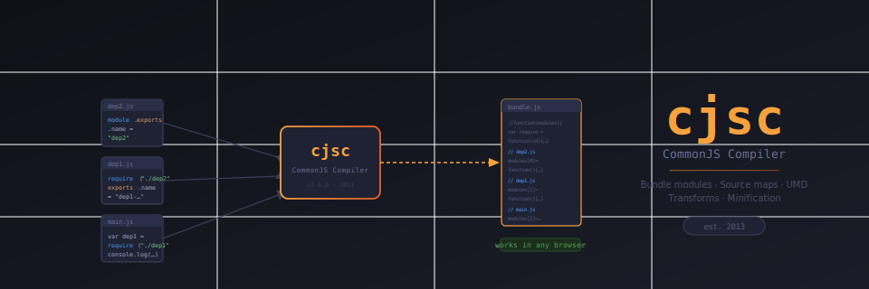

# cjsc - CommonJS Compiler



[](https://www.npmjs.com/package/cjsc)

Bundles CommonJS modules into a single browser-ready JavaScript file. No config needed for the common case. Supports UMD modules, source maps, minification, and Browserify-compatible transform plugins.

```
main.js + its deps  →  cjsc  →  bundle.js (works in browser)
```

> **Historical note:** This project started in 2013, before Browserify gained traction. I had no idea about Browserify at the time and was looking for a way to make in-browser JavaScript maintainable. After studying the CommonJS spec I came up with the idea for this compiler. Nowadays modules are part of JavaScript and compilers are many. We don't need this kind of tool anymore. I keep it as a memento and make it available for academic and educational purposes.

## Contents

- [Install](#install)
- [Basic usage](#basic-usage)
- [CLI reference](#cli-reference)
- [Programmatic API](#programmatic-api)
- [Dependency config](#dependency-config)
- [Templates (Mustache / Handlebars)](#templates)
- [Transform plugins](#transform-plugins)
- [Source maps](#source-maps)
- [The module object](#the-module-object)
- [Caching](#caching)
- [Demo scripts](#demo-scripts)

---

## Install

```bash
npm install cjsc --save-dev
```

or globally:

```bash
npm install -g cjsc
```

## Basic usage

Given this module tree:

`main.js`
```js
var dep1 = require("./lib/dep1");
console.log(dep1.name);
```

`lib/dep1.js`
```js
var dep2 = require("./dep2");
console.log("dep1 __dirname:", __dirname);
exports.name = "dep1-" + dep2.name;
```

`lib/dep2.js`
```js
module.exports.name = "dep2";
```

Compile:
```bash
cjsc main.js -o bundle.js
```

The output `bundle.js` runs in any browser with no external dependencies.

---

## CLI reference

```
cjsc <src-path> <dest-path> [options]
```

| Flag | Short | Description |
|------|-------|-------------|
| `--output` | `-o` | Destination file |
| `--minify` | `-M` | Minify output with UglifyJS |
| `--config` | `-C` | JSON config file for dependency overrides |
| `--transform` | `-t` | Browserify-compatible transform (see below) |
| `--plugin` | `-p` | Plugin module |
| `--source-map` | | Source map output path. Use `*` for auto-naming |
| `--source-map-url` | | URL embedded in the bundle pointing to the map |
| `--source-map-root` | | Source root path relative to the map file |
| `--banner` | | Prepend a string (e.g. a copyright comment) to the output |
| `--debug` | | Verbose compiler output |
| `--help` | `-h` | Print help |

Examples:

```bash
# Basic
cjsc main.js -o bundle.js

# With minification and banner
cjsc main.js -o bundle.js -M --banner="/*! My App v1.0 */"

# Source map with automatic naming
cjsc main.js -o build/bundle.js --source-map=build/*.map

# Source map with explicit root
cjsc main.js -o build/bundle.js --source-map=build/*.map --source-map-root=../src

# Transform (Browserify syntax)
cjsc main.js -o bundle.js -t [ babelify --presets [ @babel/preset-env ] ]
```

---

## Programmatic API

```js
var cjsc = require("cjsc");

cjsc(
  {
    targets: ["./src/main.js", "./build/bundle.js"],
    options: {
      minify: true,
      config: "./config.json",
      banner: "/*! built by cjsc */"
    }
  },
  null,           // inline config object (alternative to config file)
  function(code) {
    console.log("Done. Bundle size:", code.length);
  }
);
```

The second argument accepts a config object directly (same schema as the JSON config file) and takes precedence over `options.config`.

---

## Dependency config

For 3rd-party libraries that don't use CommonJS, use a config file.

`config.json`:
```json
{
  "jQuery": {
    "path": "./vendors/jquery.min.js"
  },
  "tooltipPlugin": {
    "path": "./vendors/jquery.tooltip.js",
    "require": "jQuery",
    "exports": "jQuery"
  }
}
```

Each key is the module id used in `require()`. Available fields:

| Field | Type | Description |
|-------|------|-------------|
| `path` | string | File path relative to project root |
| `globalProperty` | string | Use a global variable instead of loading a file |
| `exports` | string \| string[] | Variable(s) to export from the module |
| `require` | string \| string[] | Dependency id(s) to inject before the module runs |

Use the config with `--config`:
```bash
cjsc main.js -o bundle.js --config=config.json
```

### Making a global variable require-able

If jQuery is already on the page (loaded via a CDN), map it as a module:

`config.json`:
```json
{
  "jQuery": { "globalProperty": "jQuery" }
}
```

`main.js`:
```js
var $ = require("jQuery");
```

### Exporting from a non-module script

`config.json`:
```json
{
  "lib": {
    "path": "./vendors/lib.js",
    "exports": ["exp1", "exp2"]
  }
}
```

Or inline via the second `require()` argument (no config needed):
```js
var exp1 = require("./vendors/lib.js", "exp1", "exp2").exp1;
```

---

## Templates

Non-JS files are bundled as strings. This works with any templating engine.

### Mustache

`example.tpl`:
```
{{title}} spends {{calc}}
```

`main.js`:
```js
var mustache = require("./mustache"),
    tpl = require("./example.tpl");

console.log(mustache.render(tpl, {
  title: "Joe",
  calc: function() { return 2 + 4; }
}));
```

### Handlebars

`example.hbs`:
```html
<div class="entry">
  <h1>{{title}}</h1>
  <div class="body">{{body}}</div>
</div>
```

`main.js`:
```js
var Handlebars = require("./handlebars", "Handlebars").Handlebars,
    tpl = require("./example.hbs");

console.log(Handlebars.compile(tpl)({ title: "Post", body: "Content" }));
```

---

## Transform plugins

cjsc supports Browserify-compatible transform streams. Any module that exports `function(file, options)` and returns a Transform stream will work.

```bash
npm install babelify @babel/preset-env --save-dev
cjsc main.js -o bundle.js -t [ babelify --presets [ @babel/preset-env ] ]
```

Custom plugin example:

```js
"use strict";
var Transform = require("stream").Transform;

module.exports = function(file, opts) {
  var code = "";
  return new Transform({
    transform: function(chunk, enc, next) {
      code += chunk.toString("utf8");
      next();
    },
    flush: function(next) {
      this.push(Buffer.from(code.replace(opts.from, opts.to)));
      next();
    }
  });
};
```

Usage:
```bash
cjsc main.js -o bundle.js -t [ my-transform --from "dev" --to "prod" ]
```

---

## Source maps

```bash
# Automatic map file naming (bundle.js -> bundle.js.map)
cjsc main.js -o build/bundle.js --source-map=build/*.map

# Explicit map URL in the output
cjsc main.js -o build/bundle.js --source-map=build/bundle.js.map --source-map-url=http://localhost/

# Sources relative to the map file
cjsc main.js -o build/bundle.js --source-map=build/*.map --source-map-root=../src
```

---

## The module object

Every module has access to a `module` object matching the Node.js spec:

| Property | Type | Description |
|----------|------|-------------|
| `module.id` | string | Module identifier (resolved file path) |
| `module.filename` | string | Fully resolved filename |
| `module.loaded` | boolean | Whether the module finished loading |
| `module.parent` | Object | The module that required this one |
| `module.children` | Object[] | Modules required by this one |

Node.js globals `__dirname`, `__filename`, and `__modulename` are also available:

```js
console.log(__dirname);     // directory of this file
console.log(__filename);    // path of this file
console.log(__modulename);  // module:relative/path (without .js)
```

---

## Caching

Identical to Node.js. Modules are cached on first load. Multiple `require("foo")` calls return the same object without re-running the factory.

---

## Demo scripts

After installing dependencies (`npm install`), run from the project root:

```bash
# Generic CommonJS flow
node cjsc.js demo/use-main-flow.js -o /tmp/build.js && node /tmp/build.js

# 3rd-party library without modification
node cjsc.js demo/use-3rd-party.js -o /tmp/build.js && node /tmp/build.js

# UMD module support (Backbone, jQuery, etc.)
node cjsc.js demo/use-umd.js -o /tmp/build.js && node /tmp/build.js

# Mustache templating
node cjsc.js demo/use-mustache.js -o /tmp/build.js && node /tmp/build.js

# Handlebars templating
node cjsc.js demo/use-handlebars.js -o /tmp/build.js && node /tmp/build.js

# Source map
node cjsc.js demo/source-map/src/use-main-flow.js -o demo/source-map/build.js \
  --source-map=demo/source-map/*.map --source-map-root=./src

# Config-based dependency
node cjsc.js demo/use-config.js -o /tmp/build.js --config=./demo/config/config.json && node /tmp/build.js
```

---

## Alternatives

- [Browserify](http://browserify.org/) - broader Node.js polyfill, larger output
- [Rollup](https://rollupjs.org/) - ESM-first, tree shaking
- [Webpack](https://webpack.js.org/) - full-featured bundler
- [esbuild](https://esbuild.github.io/) - extremely fast Go-based bundler
- [Vite](https://vitejs.dev/) - modern dev server + Rollup-based bundler
